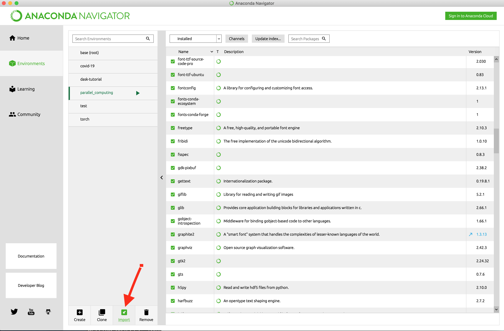
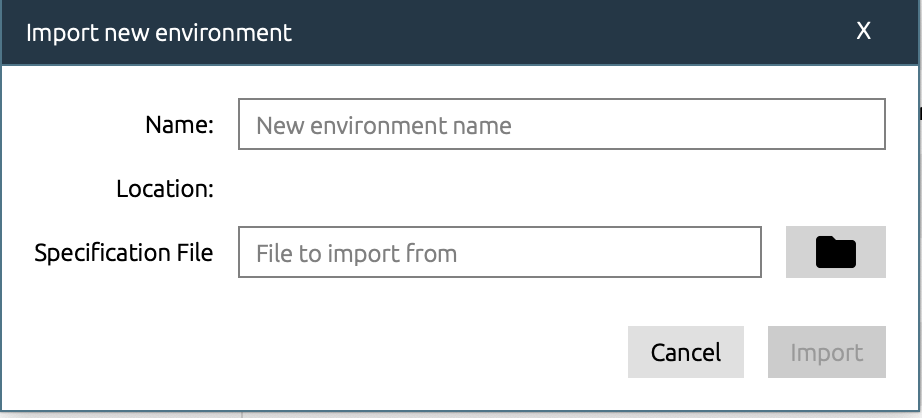
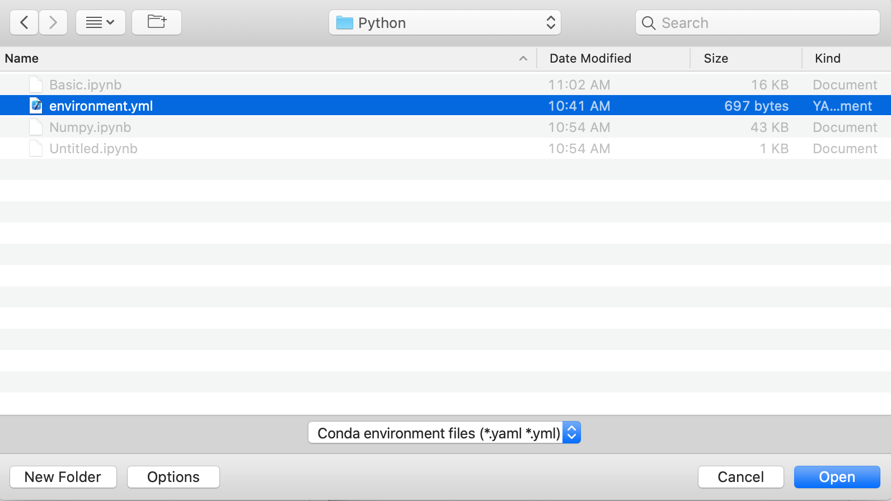

# It is the setup instructions for using Anaconda Python

## 1. Download and install Anaconda Python:
   
You may download Anaconda Python from its official website: https://www.anaconda.com

Anaconda Python is a python programming environment focusing on data science and computing. It is a cross-platform system when you may install on Windows, Linux or Mac. You may find the installation instructions for your OS on the following webpage: 
   
https://docs.anaconda.com/anaconda/install/

## 2. Getting Started with Anaconda:

After installation, you may get started by using Anaconda Navigator. Find the Anaconda Navigator from your programs. See the following webpage for details. 

https://docs.anaconda.com/anaconda/user-guide/getting-started/

## 3. Set up your own Python environment:

After launching the Anaconda Navigator, you may see the Home page of several Python programming interface. 

https://docs.anaconda.com/anaconda/navigator/

You need to set up your Python enviroments first. Download the environment.yml in the github repository under Python/Env and use it as the imported enviroment file. 

- Select the Environments in Anaconda Navigator, and then click the import button.

- Select the file icon to select your environment file.

- Choose the environment.yml file in the Python/Env folder and start importing your enviornment.

## 4. Start your JupyterLab

1. Go back to Home,
2. Select the parallel_computing as your environment,
3. Launch JupyterLab,

4. Go to your web browser, it started....

## Congratulations, you are good to start programming using Jupyter Notebook with Anaconda Python! Happy coding.

