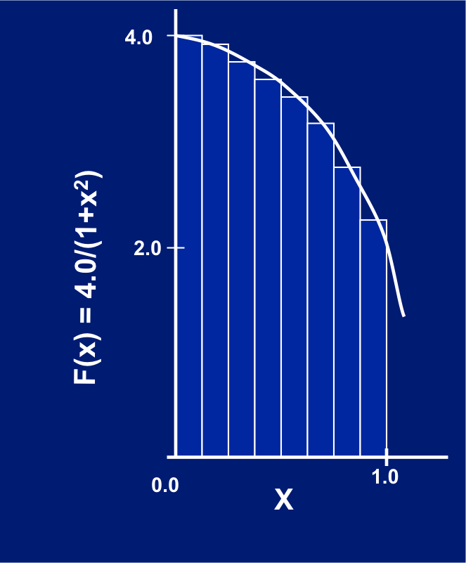

Parallel Computing Lab 3
========================

The lab 3 is to create a parallel program using OpenMP to calculate PI.:: 

	cd labs/lab3
	make
	make run

You need to revise the pi_omp.cpp file by adding OpenMP parallel region inside. 

You need to revise the program using three different ways to parallelize the code. 

#. SPMD: calcuate the workload for each thread based on the thread ID.

#. OMP for with synchronization: use `omp for` to paralleize the loop, and then use the critical section to get the final result.

#. Reduction: use OpenMP reduciton to get the fastest andthe least revised code. 

